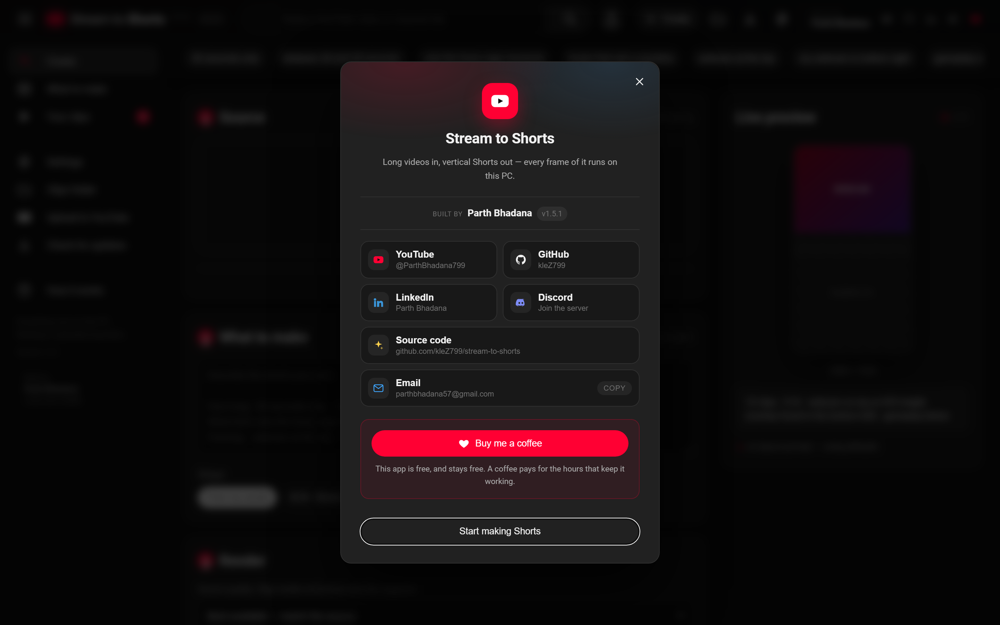
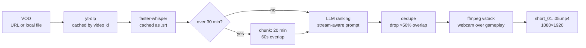
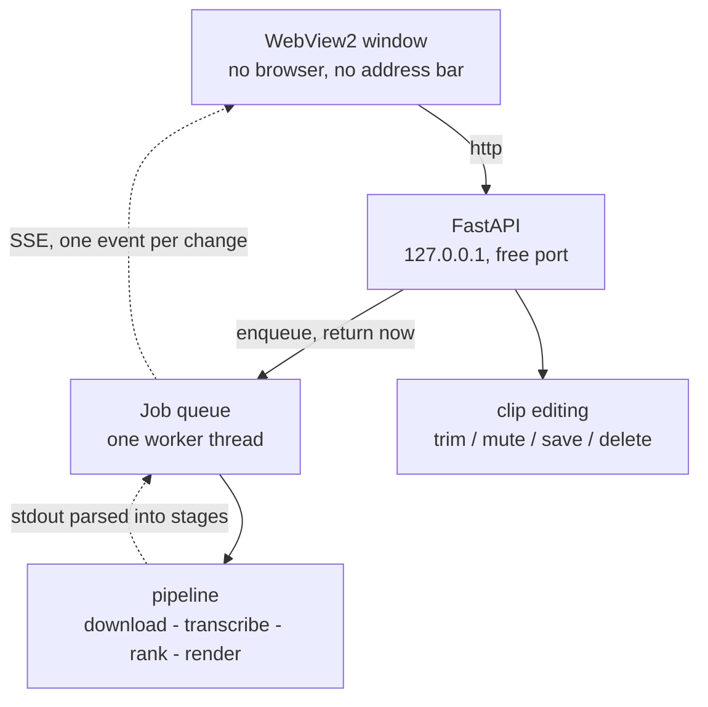

<div align="center">

# 🎮 Stream → Shorts

### Turn long videos into vertical Shorts — on your own PC

An AI clip generator for stream VODs, podcasts, and any long video: it finds the
moments worth posting and cuts them to 9:16 for **Shorts, Reels and TikTok**.

No subscription, no per-clip credits, no watermark, and nothing is uploaded —
transcription and ranking both run locally.

[](https://github.com/kleZ799/stream-to-shorts/releases/latest/download/StreamToShorts.exe)
[](https://github.com/kleZ799/stream-to-shorts/releases/latest)
[](LICENSE)

<!-- These read GitHub live, so a new release renames them on its own and
     there is no version number in this file to go stale. -->
[](https://github.com/kleZ799/stream-to-shorts/releases/latest)
[](https://github.com/kleZ799/stream-to-shorts/releases/latest)
[](https://github.com/kleZ799/stream-to-shorts/releases)

**Built by [Parth Bhadana](https://github.com/kleZ799)**
&nbsp;·&nbsp; [YouTube](https://www.youtube.com/@ParthBhadana799)
&nbsp;·&nbsp; [GitHub](https://github.com/kleZ799)
&nbsp;·&nbsp; [LinkedIn](https://www.linkedin.com/in/parth-bhadana-530014202/)
&nbsp;·&nbsp; [Discord](https://discord.gg/jnMrGbBz3m)

**No Python. No ffmpeg. Nothing to install.** Double-click and go.




</div>

---

## What it does

### Describe the layout. Don't configure it.

Type *"webcam at the top, vertical for Shorts, 5 clips"* and the frame updates as
you type. Want one exact moment instead? Say *"cut 14:45 to 15:30"* and it skips
the ranking entirely. The chips are shortcuts for phrases it already understands.

### It keeps going when the AI provider does not

Ranking a long VOD is a dozen calls to one company's servers, and free tiers get
busy. A real run reached chunk 9 of 12 and started getting `503 UNAVAILABLE`,
with an 11.9 GB download and a 29-minute transcription already paid for.

Retrying Google does not fix Google being busy. So there is a fallback ladder:
**Gemini → Groq → OpenAI**, free before paid, switching on a spent quota *or* on
the retry budget running out. A [free Groq key](https://console.groq.com) takes a
minute and no card, and is the single best insurance for a long run.

### It speaks your language — and hears the right one

The interface ships in English, Hindi, Spanish, Portuguese, French, German and
Japanese, switchable in Settings. A fresh install is always English, and the
browser's locale is deliberately ignored — a machine set to another language
should not hand a first-run user an interface nobody chose.

Separately, the *spoken* language of the video is pinned to English by default
and changeable per run. Those are two different settings on purpose: you might
run an English interface over a Hindi stream.

### It watches the whole VOD so you don't have to

Transcribes the audio locally with faster-whisper, then ranks every moment for
what actually travels: hooks, revelations, opinion bombs, story peaks. You get
told which stage it's on, because a three-hour VOD is not a two-second wait.


### Pause it when you need your machine back

Rendering takes every core it can get. If that makes the PC unusable, **Pause**
suspends the work where it stands — ffmpeg is stopped, not asked politely to
finish the current clip — and the CPU comes back immediately. Resume picks up
where it left off; nothing is lost and nothing is re-done.

### Your clips folder is readable

Runs are filed under the **title of the video they came from**, with the date,
not a random id. Downloaded sources are named after the video too, with its
YouTube id in brackets so two videos with the same title stay apart.

The app also leaves a short note in that folder explaining what each part is,
which files are safe to delete, and which one to leave alone — because the big
downloads are the thing worth clearing out, and the manifest is the thing worth
keeping.

### No windows flashing at you

ffmpeg is a console program, and a windowed app starting one makes Windows open
a console for it. A long render used to mean dozens of black windows blinking
open and shut. They are hidden now. If you saw those and wondered what they
were: that was the video tool doing the cutting, and hiding it was overdue.

### It updates itself

The app is one .exe people download once, so a fix that ships is a fix that has
to reach them. It asks GitHub for the newest release at launch, again every
half hour while it is open, and whenever you come back to the window — so a
build published at noon reaches someone who started work at nine, without
restarting anything.

When there is one, a banner offers it. The download is checked against the
SHA-256 GitHub publishes for that file, the running exe is replaced in place,
and the app reopens on the new version. Same folder, same filename, and the
build it replaced is deleted rather than left sitting on your disk. Nothing is
touched until the checksum matches, so a failed download leaves the working
app exactly as it was.

There is a **Check for updates** button in the top bar and in the sidebar, and
the version you are running is shown in all three places, for when something
has gone wrong and you need to say which build you are on.

The mac app checks on the same schedule but stops at telling you: it is a
bundle of hundreds of files signed as one unit, and replacing that under a
running process leaves a signature that no longer matches its contents — the
app macOS then refuses to open being the one the update was meant to deliver.
So it says a version is out, and you download it.

> Builds before v1.5.0 were compiled before any of this existed and cannot be
> told about new versions. Those need one manual download — the last one.

### Clips come back ranked

Each card carries its score and the exact span it was cut from.


### Fix any cut without re-running anything

Click a clip and it opens in a player. Move the in and out points, mute it, save
it, or throw it away. Trimming re-cuts straight from the downloaded source, so
the span can **grow** as well as shrink — something you cannot do by trimming the
rendered file.


---

## Get it

[**⬇ Download StreamToShorts.exe**](https://github.com/kleZ799/stream-to-shorts/releases/latest/download/StreamToShorts.exe) — 229 MB, Windows, self-contained.

Double-click it. On first run it asks for a [free Gemini API key](https://aistudio.google.com/apikey), which is stored only on your machine.

**This is the only time you download by hand.** From v1.5.0 the app updates
itself: it notices new releases, checks them, and replaces itself in place.

**On a Mac**, take `StreamToShorts-macOS-arm64.zip` from the
[latest release](https://github.com/kleZ799/stream-to-shorts/releases/latest),
unzip it, and drag the app to Applications. Apple Silicon only — an M1 or
later. It is the same app doing the same work, with two differences worth
knowing before you start: macOS will not open it on the first try (below), and
it tells you about new versions rather than installing them, so an update means
downloading it again.

<details>
<summary>macOS says the app "cannot be opened" — what to do</summary>

The mac build is signed, but not by Apple — notarising costs $99 a year and
this is free software. So Gatekeeper stops the first launch and says the app
is damaged or cannot be checked for malware. Nothing is damaged; macOS is
telling you it has never seen this developer.

Once, on first launch:

1. Double-click the app. Let it be refused.
2. Open **System Settings → Privacy & Security**, scroll down, and click
   **Open Anyway** next to the message about StreamToShorts.
3. Confirm. It opens normally from then on.

Right-click → Open, which used to be the shortcut for this, no longer works on
macOS 15 and later.

The same things you can check on Windows apply here: every line is public, the
app is built from this repository by GitHub's own runners, and each release
publishes a SHA-256 for the file.

</details>

<details>
<summary>Windows says it isn't safe — is it?</summary>

Windows shows **"Windows protected your PC"** because the exe is not
code-signed. Certificates cost a few hundred dollars a year and this is free
software; SmartScreen is reporting the missing signature, not a finding about
the file. It says the same about most independent software on release day.

What you can check instead of taking that on trust:

- **Every line is public**, and the exe is built from this repository by
  GitHub's own runners — the [build log](https://github.com/kleZ799/stream-to-shorts/actions)
  is readable by anyone.
- **Each release publishes a SHA-256** for the exe, and the app verifies it
  when updating itself.
- **It works with the network off.** Transcribing and ranking run on your
  machine. It contacts YouTube to fetch a video, your AI provider to rank
  moments, and GitHub to check for updates. Your video never leaves the PC.

To run it: **More info → Run anyway**.

</details>

<details>
<summary>First-run details</summary>

- **Windows will warn you.** The exe isn't code-signed, so SmartScreen shows *"Windows protected your PC"*. Click **More info → Run anyway**. On a Mac it is Gatekeeper instead — see above.
- **First launch is slow.** It's a single file that unpacks itself each time. The mac app is a normal bundle and starts faster.
- **Where things go.** The key lives at `%APPDATA%\StreamToShorts\settings.json`; clips go to `%USERPROFILE%\Videos\StreamToShorts`, changeable in Settings. On a Mac: `~/Library/Application Support/StreamToShorts/settings.json` and `~/Movies/StreamToShorts`.
- **ffmpeg is bundled**, so there is nothing else to install — on both platforms.
- **The downloadable .exe transcribes on the CPU.** The CUDA runtime is 2GB, and a single-file exe re-unpacks its whole payload on every launch — so bundling it would cost every user a slow start for something only NVIDIA owners can use. If you have an NVIDIA card and want the ~5x faster transcription, build the one-folder version from source: `pip install nvidia-cublas-cu12 nvidia-cudnn-cu12` then `python build_exe.py` (CUDA is the default there; `--no-cuda` opts out).

</details>

Everything below is for running from source, which you only need if you want to
change how it works.

> 📚 **Want to understand the internals?** [HOW_IT_WORKS.md](HOW_IT_WORKS.md) is a
> study companion to this repo — the pipeline stage by stage, the ranking prompts,
> the three renderers, the job runner, the frontend, and why each is built the way
> it is. Written to be read end-to-end.
>
> 🎓 **Preparing to explain this to someone?** [CONCEPTS.md](CONCEPTS.md) covers the
> ideas rather than the files — the AI/ML and computer-science concepts this project
> actually uses, each anchored to a real decision in the code, plus the questions an
> interviewer is likely to ask about it.

---

## What I built

This began as a fork of [Anil-matcha/AI-Youtube-Shorts-Generator](https://github.com/Anil-matcha/AI-Youtube-Shorts-Generator) (MIT), a
command-line script that crops talking-head videos. That origin is why GitHub
lists its authors as contributors here — their commits are genuinely in this
repo's history, and the licence keeps them credited.

Rather than assert a boundary, here is the measured one. `git blame` over the
current tree, 14,020 lines:

| | Lines | Share |
|---|---:|---:|
| **Parth Bhadana** | **12,519** | **89.3%** |
| Anil Matcha (base) | 1,175 | 8.4% |
| Arael Espinosa | 204 | 1.5% |
| LathissKhumar | 122 | 0.9% |

Code only, excluding documentation: **88.3%** mine. Since the fork point
(`c30376e`, 29 Jul 2026): **96 of 117 commits**, **+12,709 / −358 lines**, and
**27 of the 48 files** did not exist before.

Run `git blame` yourself — that is rather the point of quoting a number instead
of a claim.

The boundary is easy to draw. **Upstream gave a CLI that face-crops a single
speaker. Everything that makes this a stream tool, and everything that makes it
an application, is mine:**

**The application** — none of this existed upstream
- A **desktop app**: a FastAPI server on a free port, run from a background thread, behind a native WebView2 window. No browser, no address bar, no terminal.
- A **job runner** — queued work, one CPU-bound job at a time, progress streamed to the browser over SSE.
- A **clip editor** — re-cut, mute, save or delete a finished clip without re-running the pipeline.
- The **interface**, built on YouTube's own layout so the audience already knows how to use it.
- A **single-file Windows build** with ffmpeg bundled, so a non-technical user installs nothing.

**The stream intelligence** — upstream ranks any talking-head video; this one understands streams
- **`local/gaming_layout.py`** — the entire webcam-over-gameplay renderer: corner-scoped face location, median-stabilised framing, single-pass ffmpeg `vstack`.
- **`STREAM_VIRALITY_CRITERIA`** — a ranking prompt that separates streamer speech from game narration on one mixed track, and refuses any clip without the streamer in it.
- **Natural-language layout parsing** — "webcam top, 5 clips" or "cut 14:45 to 15:30" resolves to a render spec, with an exact-span path that skips transcription and ranking entirely.

**The bugs that made it actually work**
- **Chunk timestamp rebasing** — long videos returned *zero* highlights before this; every chunk past the first had its timestamps clamped away.
- **High-resolution clipper fixes** — non-contiguous OpenCV slices, Windows file-handle races, downscaled Haar detection.
- **Gemini support** — provider dispatch, a token budget that survives the model's internal reasoning, and 429 backoff that reads the server's own retry hint.
- **`opencv-python<5` pin** — 5.x removed `CascadeClassifier`, which the face tracking depends on.

---

## The problem this solves

I stream story games and post Shorts. The math of that is brutal: a 35-minute session has maybe five clippable moments in it, and finding them means scrubbing the whole VOD twice.

Worse, every off-the-shelf clipper fails on stream footage for the same two reasons:

1. **They crop to the wrong thing.** Auto-croppers slide a vertical window around hunting for a face. On a stream, the biggest face on screen is usually a *game character* — so the clip ends up centred on a cutscene with my commentary playing over it from off-frame.
2. **They can't tell me from the game.** A story game's audio is narration, dialogue, and score, all mixed onto the same track as my mic. Generic highlight detection happily hands back 45 seconds of beautifully-written game narration with zero streamer in it. That's not my content. That's the studio's.

This fixes both.

---

## The layout that actually works

Every clip renders as **webcam over gameplay**, because that's the format that survives a vertical crop:

```
┌──────────────────────┐
│                      │
│       WEBCAM         │   42% — auto-located, cropped to
│    (your reaction)   │        head-and-shoulders
│                      │
├──────────────────────┤
│                      │
│                      │
│      GAMEPLAY        │   58% — centre crop, nudged away
│                      │        from the webcam corner
│                      │
│                      │
└──────────────────────┘
        1080 × 1920
```

The webcam isn't a hardcoded rectangle. Each clip gets its overlay **located from scratch**:

- Sample 6 frames spread across the clip
- Run face detection, but **only inside the corner the overlay lives in** — so a character's face in the game can't win
- Take the **median** of the hits, not the mean, so one bad frame can't drag the framing off
- Build a crop ~5× the face width for head-and-shoulders framing

Then the whole thing renders in **one ffmpeg pass** — crop, crop, scale, `vstack`. No per-frame Python. Clips render in seconds instead of minutes.

If no face turns up anywhere, it falls back to a centre crop and says so in the log rather than silently shipping garbage.

---

## How a VOD becomes Shorts



Four stages, and **every expensive one is cached.**

### 1. Get the file

Already have the VOD on disk? Pass the path — it's used as-is, nothing downloads. Otherwise yt-dlp grabs it as `source_<videoid>.mp4`, and if that id is already in `output/` it gets reused. Reruns don't re-download.

### 2. Transcribe

faster-whisper, on your CPU (`int8`) or GPU (`float16`) — auto-detected. The transcript is cached beside the video as an `.srt`, validated by modification time.

**The spoken language is pinned to English by default**, changeable per run in the Render panel, with an explicit `auto` for genuinely mixed sources. This matters more than it sounds: left on auto-detect, whisper drifts on game audio and music beds and starts emitting fluent nonsense in a language nobody spoke. One 3h47m English stream came back with 703 of its 1097 cues in hallucinated Korean — and one of those cues became a clip title.

**GPU detection asks CTranslate2, not torch.** faster-whisper runs on CTranslate2; torch is not installed and is explicitly excluded from the build, so probing `torch.cuda.is_available()` silently sent every machine down the CPU path. If you have an NVIDIA card, `pip install nvidia-cublas-cu12 nvidia-cudnn-cu12` — the packaged one-folder build already ships them. Measured on an RTX 5060 (8GB): 900s of audio with the `small` model, **104.2s on CPU → 20.8s on CUDA**.

**This is the slowest step in the pipeline and you pay it exactly once per VOD.** Every re-rank and re-render after that is free.

### 3. Rank the highlights

This is the part that's actually tuned for streams. The model is told, explicitly, that it's reading a single mixed audio track with no speaker labels, and taught to separate the two voices by register:

> **Game narration** reads like written prose — literary, past tense, polished, no filler words, never addresses anyone.
>
> **The streamer** sounds spoken — reactions, false starts, laughter, swearing, questions, talking to chat.

And then the hard rule: **every highlight must contain the streamer's own speech.** A story beat only counts when you react to it, talk over it, or respond after it.

Ranking prioritises, in order: reactions to story beats → raw unscripted spikes → fails and disasters → hot takes → chat interaction → personal tangents → quotable one-liners → sincerity. Dead air, loading screens, and stream housekeeping are explicitly skipped, and clips start *on* the hook rather than the run-up — a Short is judged in its first second, so the opening line has to earn the watch by itself.

Long VODs get chunked into 20-minute windows with 60s of overlap, each rebased to zero and offset back afterward. Anything overlapping >50% with a higher-scoring pick is dropped, so you never get two near-identical clips.

Every clip comes back with a score, a title, and a one-line reason it should work.

### 4. Render

Cut and stack in one ffmpeg pass, straight to 1080×1920 h264 with `+faststart`. Upload-ready for Shorts, Reels, and TikTok with no server-side re-encode.

---

## Quickstart

**Prerequisites:** Python 3.10+, `ffmpeg` on your PATH, and a [free Gemini API key](https://aistudio.google.com/apikey).

```bash
git clone https://github.com/kleZ799/stream-to-shorts.git
cd stream-to-shorts
python -m venv venv
venv\Scripts\activate
pip install -r requirements-local.txt
```

On macOS or Linux, activate with `source venv/bin/activate` instead.

Copy `.env.example` to `.env` and fill it in:

```ini
LLM_PROVIDER=gemini
GEMINI_API_KEY=your_key_here
GEMINI_MODEL=gemini-3.6-flash
LOCAL_WHISPER_MODEL=base
LOCAL_WHISPER_DEVICE=auto
LOCAL_OUTPUT_DIR=output
LOCAL_OUTPUT_RESOLUTION=1080x1920
```

Then point it at a VOD:

```bash
python main.py "https://www.youtube.com/watch?v=YOUR_VOD" --mode local --num-clips 5 --format 1080 --output-json result.json
```

Or run it against a file you already have:

```bash
python main.py "D:/streams/session-14.mp4" --mode local --num-clips 5
```

Clips land in `output/` as `short_01.mp4` … `short_05.mp4`, alongside a `result.json` holding the full transcript, every candidate considered, and the winning picks.

---

## Using it

**Running from source:**

```bash
pip install -r requirements-web.txt
python desktop.py
```

Prefer it in a browser instead? `python -m webapp` serves it at http://127.0.0.1:8000.

**Building the executable yourself:**

```bash
pip install -r requirements-web.txt pyinstaller
python build_exe.py --onefile --clean
```

Put `ffmpeg.exe` and `ffprobe.exe` in a `./bin` folder first and they get bundled,
which is how the published build needs nothing installed. That's what makes it
229 MB; without them it's 153 MB and ffmpeg has to be on the user's PATH. Drop
`--onefile` for a folder build that starts faster but has to be zipped to share.

On a Mac the same command without `--onefile` produces `dist/StreamToShorts.app`:
the icon is rendered from `assets/icon.png`, the version is written into
Info.plist, and the bundle is signed ad-hoc so Apple Silicon will run it at all.
Put static `ffmpeg` and `ffprobe` binaries in `./bin` — a Homebrew ffmpeg links
against dylibs in `/opt/homebrew` and would only work on your own machine.
PyInstaller cannot cross-compile, so the published mac build is made on a macOS
runner by [the release workflow](.github/workflows/release.yml), which is also
where those two download URLs live.

**Drop a file or paste a link.** Drag a VOD straight in, or paste a YouTube URL. Paste a *channel* link and it lists the 12 most recent videos as a grid to pick from.

**Clips come out at the source's real quality.** The renderer measures the crop it's actually going to take and picks the highest standard size that crop genuinely supports — a stacked 1440p stream renders at 1440×2560 rather than being flattened to 1080p. It won't upscale past what the footage holds, because inventing pixels only grows the file.

**Describe the layout in plain English.** A live preview redraws as you type — the real frame shape, the real webcam panel height — so you can see your words land before spending a single second of render time:

| Type this | You get |
|---|---|
| `webcam at the top` | the stacked layout |
| `my webcam is bottom right` | which corner to hunt for your overlay |
| `square, bigger webcam` | 1:1, panel at 55% |
| `gameplay only, no webcam` | plain centre crop |
| `follow my face` | face-tracking crop |
| `3 clips` | how many to make |
| `cut 14:45 to 15:30` | **exact span, no AI ranking** |

Combine them freely — `cut 14:45 to 15:30, gameplay only, square` does all three.

Parsing is keyword-first and runs in about 70ms, so the preview keeps up with typing and costs no quota. Only genuinely novel phrasing falls through to the LLM.

### Naming an exact span

Give it a timecode and it **skips transcription and ranking entirely** and cuts exactly what you asked for. `14:45 to 15:30`, `1:30-2:45`, `00:14:45 - 00:15:28`, `885s to 928s`, or several at once with `14:45-15:30 and 24:55-25:40`.

This is the fast path: no Whisper, no LLM, straight to ffmpeg. Seconds instead of minutes, and it costs nothing. Use it when you already know where the moment is — which, after you've watched your own stream, is most of the time.

Jobs run one at a time on a background worker, because Whisper and ffmpeg are both CPU-bound and racing them makes both slower. Progress streams live with the pipeline log.

> Everything runs on your machine and binds to localhost only. Your VODs are never uploaded anywhere — the only thing that leaves is the transcript text sent to the ranking model, and even that is skipped entirely when you name an exact span.
>
> If you serve it to your network with `python -m webapp --host 0.0.0.0`, note there's no authentication and every job spends **your** API quota and **your** CPU.

---

## The workflow I actually use

Ranking and rendering are separate on purpose, because they fail for different reasons and cost different amounts.

**First pass** — transcribe, rank, render. Slow, once per VOD.

**Then read the picks.** They're plain JSON with timestamps. Nudge a start time back three seconds, drop the one that didn't land, retitle the good ones.

**Re-render from the edited list** — with no LLM calls at all. On Gemini's free tier this matters: re-ranking a long VOD burns quota, and once you've hand-picked five timestamps, re-ranking is pure waste. The rate-limit handler parses the `retry in Xs` hint out of a 429 and honours it rather than dropping the whole run — but the best fix is not making the call.

One trick worth stealing: **transcribe from the 720p download, render from a 1440p one.** Whisper doesn't care about resolution and CPU transcription is the bottleneck, so you get cheap transcription and a sharp render out of the same session.

---

## Tuning

The knobs that change output quality most, in order:

| Knob | Where | What it does |
|---|---|---|
| `ACTIVE_VIRALITY_CRITERIA` | `shorts_generator/highlights.py` | Stream-aware vs generic ranking. **The single biggest lever.** Set it to `VIRALITY_CRITERIA` for podcast or talking-head footage |
| `corner` | `local/gaming_layout.py` | Which corner your webcam overlay sits in. `bottom-left` by default |
| `CAM_PANEL_FRACTION` | `local/gaming_layout.py` | Webcam panel height, `0.42` by default |
| `FACE_CONTEXT_MULTIPLE` | `local/gaming_layout.py` | Webcam zoom. Lower is tighter on your face |
| `MAX_CLIP_SECONDS` | `shorts_generator/highlights.py` | Hard reject above 90s. The prompt separately targets 18–35s, because the completion bar gets stricter the longer a clip runs |
| Provider | Settings | Gemini, Groq or OpenAI. Add a **free Groq key** as a fallback so a busy Gemini cannot end a run |
| `LOCAL_WHISPER_MODEL` | `.env` | `base` is plenty for ranking. `small` reads better and hallucinates less — and on a GPU it is *faster* than `base`, so use it if you have one |
| Spoken language | Render panel | English by default. Pinning it is the fix for whisper inventing text in another language |
| Interface language | Settings | English, Hindi, Spanish, Portuguese, French, German, Japanese |

---

## Two modes

| | `--mode local` | `--mode api` |
|---|---|---|
| **Download** | yt-dlp | MuAPI |
| **Transcription** | faster-whisper, on your machine | MuAPI Whisper |
| **Ranking** | Gemini or OpenAI, your key | MuAPI |
| **Cropping** | ffmpeg + OpenCV, your machine | MuAPI auto-crop |
| **VODs leave your machine?** | Only the transcript text | Yes, the whole video |
| **Cost** | Free tier covers a lot | Per-call |

Local mode is what this repo is built around. API mode is inherited from upstream and still works if you'd rather not run anything locally.

---

## Under the hood

### The app



**Requests never block on the pipeline.** Transcribing alone outlives any sensible
HTTP timeout, so `POST /api/jobs` only ever enqueues and returns an id; the
browser follows along over server-sent events. Jobs run **one at a time on a
single worker thread** on purpose — Whisper and ffmpeg are both CPU-bound, and
running two at once makes both slower than running them in sequence.

**Progress is derived, not guessed.** The pipeline already narrates itself to
stdout, so the runner captures it line by line, maps prefixes like `[transcribe]`
or `[stack] 2/5` onto stages, and gives each stage a band of the bar. A render
that reports `3/5` moves the bar to the right place inside the render band
without the pipeline knowing a UI exists.

**Updating replaces the running exe with itself.** Windows will not let a
running .exe be overwritten, but it will let it be *renamed* — so the running
file is moved aside, the verified download takes its name, and the app
relaunches from the same path. The rename happens only after the SHA-256
matches, so a bad download never becomes the thing that runs; if the second
move fails the original is put straight back. The replaced build cannot be
deleted immediately — the process that was running it is still shutting down
and still holding it open — so cleanup retries in the background until the
handover completes.

The page never handles a download URL. It asks the server to install *the*
update, and the server resolves what that means from the repository compiled
into the build, so nothing rendered in the window can aim the updater at a file
of its choosing.

**Editing re-cuts from the source, not the render.** Trimming a clip re-runs the
renderer over the original download with new timestamps, which is why the span
can grow as well as shrink — trimming the rendered file could only ever remove.
Clip filenames are resolved against the job's own directory and rejected if they
escape it.

### The engine

Both modes share one highlight engine. They agree on a single transcript shape:

```python
{"duration": 2130.0, "segments": [{"start": 12.4, "end": 15.1, "text": "..."}]}
```

Whichever transcriber ran, `highlights.py` can't tell the difference. The LLM is injected the same way — `get_highlights(transcript, llm_fn=...)` takes *the function that calls a model* as an argument, so swapping Gemini for OpenAI for MuAPI touches one line, and the ranking logic stays a single copy that can't drift.

```
shorts_generator/
├── pipeline.py            # orchestrator — picks local vs api
├── highlights.py          # the brain: prompts, chunking, dedupe
└── local/
    ├── downloader.py      # yt-dlp + download cache
    ├── transcriber.py     # faster-whisper + .srt cache
    ├── llm.py             # Gemini / OpenAI + rate-limit backoff
    ├── clipper.py         # face-tracking crop (talking-head footage)
    └── gaming_layout.py   # webcam-over-gameplay stack (streams)
```

## Staying in sync with upstream

This repo is standalone, but it keeps a link back to the project it grew out of, so upstream fixes can be pulled in whenever they're worth having.

One-time setup after cloning:

```bash
git remote add upstream https://github.com/Anil-matcha/AI-Youtube-Shorts-Generator.git
```

Then, whenever you want upstream's changes:

```bash
git fetch upstream
git merge upstream/main
```

Conflicts, when they happen, land almost entirely in `highlights.py` — upstream edits the generic virality prompt while this repo runs the stream-aware one. **Keep `ACTIVE_VIRALITY_CRITERIA` pointed at `STREAM_VIRALITY_CRITERIA`** and take upstream's changes everywhere else. `local/gaming_layout.py` doesn't exist upstream, so it never conflicts.

---

## License

MIT — see [LICENSE](LICENSE). Upstream work © Anil Chandra Naidu Matcha; modifications © Parth Bhadana.

The published `StreamToShorts.exe` also carries ffmpeg and ffprobe (the
[gyan.dev](https://www.gyan.dev/ffmpeg/builds/) essentials build), which are licensed under the
GPL v3 — not MIT. That covers the bundled binaries only; this repository's own
source stays MIT, and building from source pulls in no ffmpeg at all.

---

## Credits

**[Anil Chandra Naidu Matcha](https://github.com/Anil-matcha)** — the original
project this forks. The CLI pipeline and the highlight-ranking idea are his, and
1,175 of his lines survive here. Worth being precise about where: the largest
blocks are in `highlights.py`, `local/clipper.py`, `pipeline.py` and `muapi.py`.

**[Arael Espinosa](https://github.com/cl8dep)** — *"add gemini local llm and
local caches"*. 87 lines in `local/transcriber.py`, 65 in `local/downloader.py`,
29 in `local/llm.py`. That commit is the seed of local mode: the Gemini path
this app still runs on, and the one the Groq fallback was later built beside.

**LathissKhumar** — two commits hardening local mode: 77 lines making the
highlight JSON parsing survive bad model output, plus the VAD-off default and a
CUDA fallback in `local/transcriber.py`. The VAD default is still what ships.

Their work is in this repository because it earned its place, and the MIT
licence keeps their names on it. Everything else — the desktop application, the
stream-aware ranking, the renderers, the job runner, the interface, the
packaging — is mine.

---

## Author

**Parth Bhadana**

[YouTube](https://www.youtube.com/@ParthBhadana799) &middot; [GitHub](https://github.com/kleZ799) &middot; [LinkedIn](https://www.linkedin.com/in/parth-bhadana-530014202/) &middot; [Discord](https://discord.gg/jnMrGbBz3m)

Built and maintained by me. If you use it, fork it, or ship anything based on
it, the MIT licence asks one thing in return: keep the copyright notice.

Repository: <https://github.com/kleZ799/stream-to-shorts>
