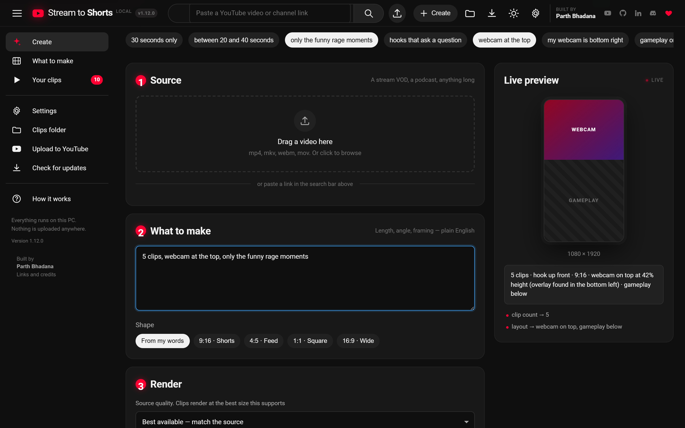
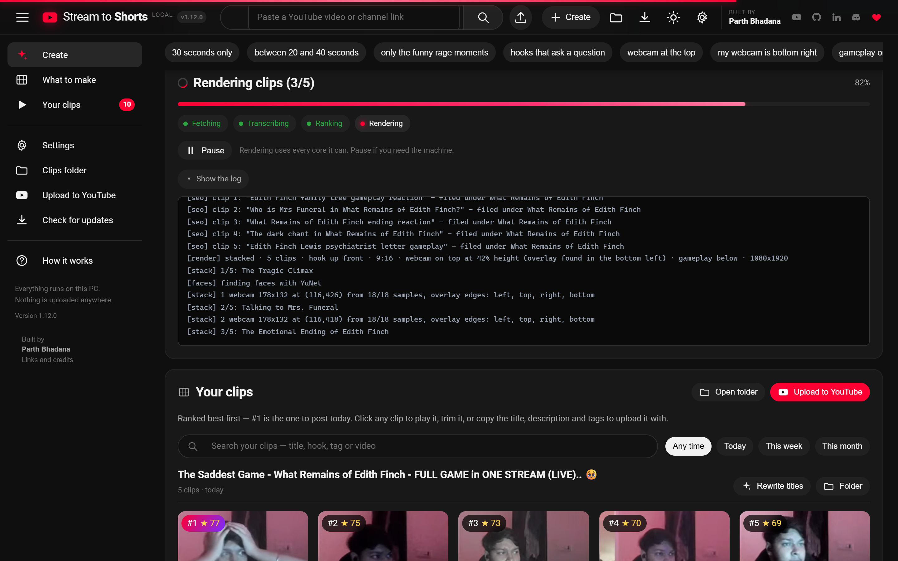
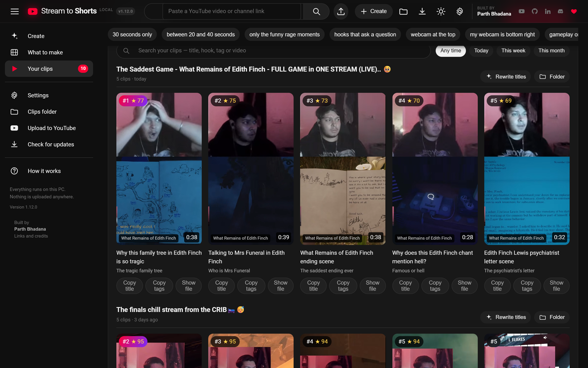
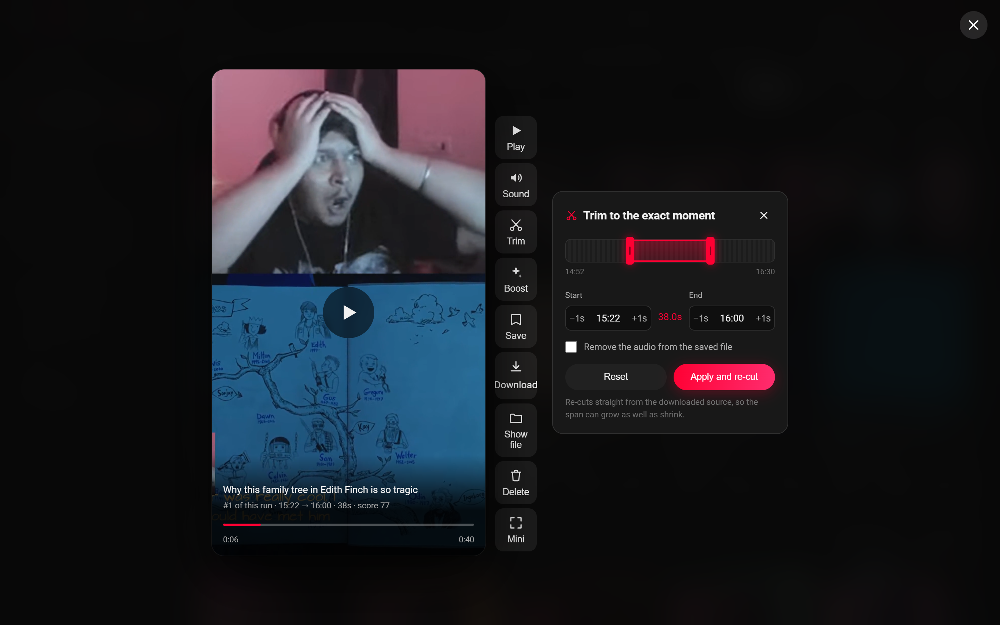
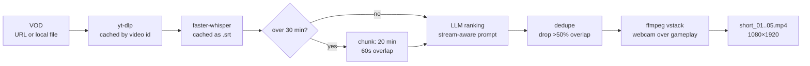
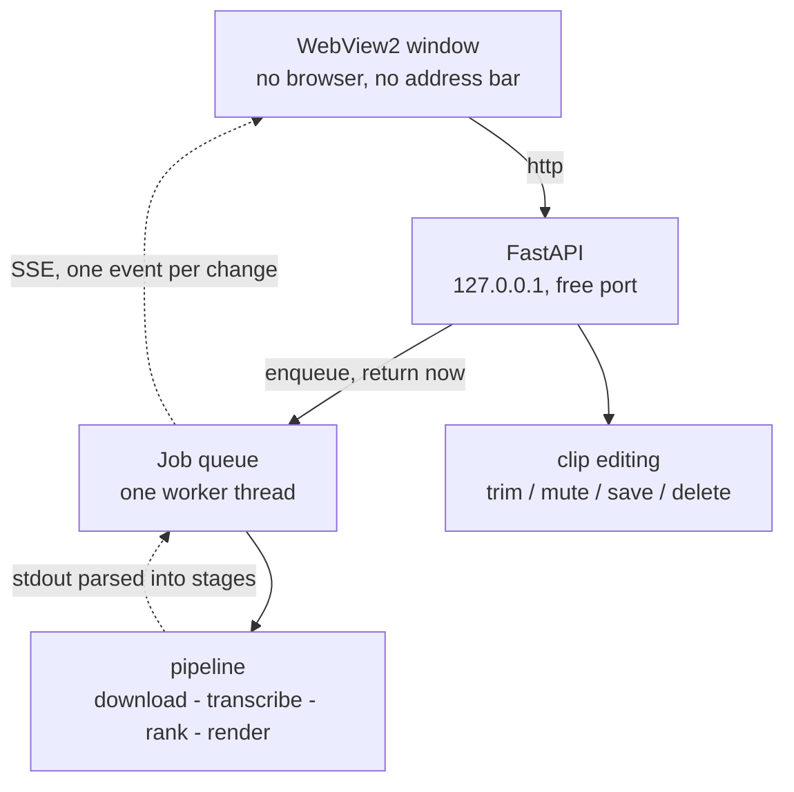

<div align="center">

# 🎮 Stream → Shorts

### Turn a 3-hour gaming VOD into five vertical clips worth posting.

Runs entirely on your PC. No subscription, no per-clip credits, no watermark,
and your VODs never leave your machine.

[](https://github.com/kleZ799/stream-to-shorts/releases/latest/download/StreamToShorts.exe)
[](LICENSE)

**No Python. No ffmpeg. Nothing to install.** Double-click and go.



</div>

---

## What it does

### Describe the layout. Don't configure it.

Type *"webcam at the top, vertical for Shorts, 5 clips"* and the frame updates as
you type. Want one exact moment instead? Say *"cut 14:45 to 15:30"* and it skips
the ranking entirely. The chips are shortcuts for phrases it already understands.

### It watches the whole VOD so you don't have to

Transcribes the audio locally with faster-whisper, then ranks every moment for
what actually travels: hooks, revelations, opinion bombs, story peaks. You get
told which stage it's on, because a three-hour VOD is not a two-second wait.



### Clips come back ranked

Each card carries its score and the exact span it was cut from.



### Fix any cut without re-running anything

Click a clip and it opens in a player. Move the in and out points, mute it, save
it, or throw it away. Trimming re-cuts straight from the downloaded source, so
the span can **grow** as well as shrink — something you cannot do by trimming the
rendered file.



---

## Get it

[**⬇ Download StreamToShorts.exe**](https://github.com/kleZ799/stream-to-shorts/releases/latest/download/StreamToShorts.exe) — 229 MB, Windows, self-contained.

Double-click it. On first run it asks for a [free Gemini API key](https://aistudio.google.com/apikey), which is stored only on your machine.

<details>
<summary>First-run details</summary>

- **Windows will warn you.** The exe isn't code-signed, so SmartScreen shows *"Windows protected your PC"*. Click **More info → Run anyway**.
- **First launch is slow.** It's a single file that unpacks itself each time.
- **Where things go.** The key lives at `%APPDATA%\StreamToShorts\settings.json`; clips go to `%USERPROFILE%\Videos\StreamToShorts`, changeable in Settings.
- **ffmpeg is bundled**, so there is nothing else to install.

</details>

Everything below is for running from source, which you only need if you want to
change how it works.

---

## What I built

This began as a fork of [Anil-matcha/AI-Youtube-Shorts-Generator](https://github.com/Anil-matcha/AI-Youtube-Shorts-Generator) (MIT), a
command-line script that crops talking-head videos. That origin is why GitHub
lists its authors as contributors here — their commits are genuinely in this
repo's history, and the licence keeps them credited.

The boundary is easy to draw. **Upstream gave a CLI that face-crops a single
speaker. Everything that makes this a stream tool, and everything that makes it
an application, is mine:**

**The application** — none of this existed upstream
- A **desktop app**: a FastAPI server on a free port, run from a background thread, behind a native WebView2 window. No browser, no address bar, no terminal.
- A **job runner** — queued work, one CPU-bound job at a time, progress streamed to the browser over SSE.
- A **clip editor** — re-cut, mute, save or delete a finished clip without re-running the pipeline.
- The **interface**, built on YouTube's own layout so the audience already knows how to use it.
- A **single-file Windows build** with ffmpeg bundled, so a non-technical user installs nothing.

**The stream intelligence** — upstream ranks any talking-head video; this one understands streams
- **`local/gaming_layout.py`** — the entire webcam-over-gameplay renderer: corner-scoped face location, median-stabilised framing, single-pass ffmpeg `vstack`.
- **`STREAM_VIRALITY_CRITERIA`** — a ranking prompt that separates streamer speech from game narration on one mixed track, and refuses any clip without the streamer in it.
- **Natural-language layout parsing** — "webcam top, 5 clips" or "cut 14:45 to 15:30" resolves to a render spec, with an exact-span path that skips transcription and ranking entirely.

**The bugs that made it actually work**
- **Chunk timestamp rebasing** — long videos returned *zero* highlights before this; every chunk past the first had its timestamps clamped away.
- **High-resolution clipper fixes** — non-contiguous OpenCV slices, Windows file-handle races, downscaled Haar detection.
- **Gemini support** — provider dispatch, a token budget that survives the model's internal reasoning, and 429 backoff that reads the server's own retry hint.
- **`opencv-python<5` pin** — 5.x removed `CascadeClassifier`, which the face tracking depends on.

---

## The problem this solves

I stream story games and post Shorts. The math of that is brutal: a 35-minute session has maybe five clippable moments in it, and finding them means scrubbing the whole VOD twice.

Worse, every off-the-shelf clipper fails on stream footage for the same two reasons:

1. **They crop to the wrong thing.** Auto-croppers slide a vertical window around hunting for a face. On a stream, the biggest face on screen is usually a *game character* — so the clip ends up centred on a cutscene with my commentary playing over it from off-frame.
2. **They can't tell me from the game.** A story game's audio is narration, dialogue, and score, all mixed onto the same track as my mic. Generic highlight detection happily hands back 45 seconds of beautifully-written game narration with zero streamer in it. That's not my content. That's the studio's.

This fixes both.

---

## The layout that actually works

Every clip renders as **webcam over gameplay**, because that's the format that survives a vertical crop:

```
┌──────────────────────┐
│                      │
│       WEBCAM         │   42% — auto-located, cropped to
│    (your reaction)   │        head-and-shoulders
│                      │
├──────────────────────┤
│                      │
│                      │
│      GAMEPLAY        │   58% — centre crop, nudged away
│                      │        from the webcam corner
│                      │
│                      │
└──────────────────────┘
        1080 × 1920
```

The webcam isn't a hardcoded rectangle. Each clip gets its overlay **located from scratch**:

- Sample 6 frames spread across the clip
- Run face detection, but **only inside the corner the overlay lives in** — so a character's face in the game can't win
- Take the **median** of the hits, not the mean, so one bad frame can't drag the framing off
- Build a crop ~5× the face width for head-and-shoulders framing

Then the whole thing renders in **one ffmpeg pass** — crop, crop, scale, `vstack`. No per-frame Python. Clips render in seconds instead of minutes.

If no face turns up anywhere, it falls back to a centre crop and says so in the log rather than silently shipping garbage.

---

## How a VOD becomes Shorts



Four stages, and **every expensive one is cached.**

### 1. Get the file

Already have the VOD on disk? Pass the path — it's used as-is, nothing downloads. Otherwise yt-dlp grabs it as `source_<videoid>.mp4`, and if that id is already in `output/` it gets reused. Reruns don't re-download.

### 2. Transcribe

faster-whisper, on your CPU (`int8`) or GPU (`float16`) — auto-detected, no config needed. The transcript is cached beside the video as an `.srt`, validated by modification time.

**This is the slowest step in the pipeline and you pay it exactly once per VOD.** Every re-rank and re-render after that is free.

### 3. Rank the highlights

This is the part that's actually tuned for streams. The model is told, explicitly, that it's reading a single mixed audio track with no speaker labels, and taught to separate the two voices by register:

> **Game narration** reads like written prose — literary, past tense, polished, no filler words, never addresses anyone.
>
> **The streamer** sounds spoken — reactions, false starts, laughter, swearing, questions, talking to chat.

And then the hard rule: **every highlight must contain the streamer's own speech.** A story beat only counts when you react to it, talk over it, or respond after it.

Ranking prioritises, in order: reactions to story beats → raw unscripted spikes → fails and disasters → hot takes → chat interaction → personal tangents → quotable one-liners → sincerity. Dead air, loading screens, and stream housekeeping are explicitly skipped, and clips start 2–5 seconds *before* the moment so the payoff has setup.

Long VODs get chunked into 20-minute windows with 60s of overlap, each rebased to zero and offset back afterward. Anything overlapping >50% with a higher-scoring pick is dropped, so you never get two near-identical clips.

Every clip comes back with a score, a title, and a one-line reason it should work.

### 4. Render

Cut and stack in one ffmpeg pass, straight to 1080×1920 h264 with `+faststart`. Upload-ready for Shorts, Reels, and TikTok with no server-side re-encode.

---

## Quickstart

**Prerequisites:** Python 3.10+, `ffmpeg` on your PATH, and a [free Gemini API key](https://aistudio.google.com/apikey).

```bash
git clone https://github.com/kleZ799/stream-to-shorts.git
cd stream-to-shorts
python -m venv venv
venv\Scripts\activate
pip install -r requirements-local.txt
```

On macOS or Linux, activate with `source venv/bin/activate` instead.

Copy `.env.example` to `.env` and fill it in:

```ini
LLM_PROVIDER=gemini
GEMINI_API_KEY=your_key_here
GEMINI_MODEL=gemini-2.5-flash
LOCAL_WHISPER_MODEL=base
LOCAL_WHISPER_DEVICE=auto
LOCAL_OUTPUT_DIR=output
LOCAL_OUTPUT_RESOLUTION=1080x1920
```

Then point it at a VOD:

```bash
python main.py "https://www.youtube.com/watch?v=YOUR_VOD" --mode local --num-clips 5 --format 1080 --output-json result.json
```

Or run it against a file you already have:

```bash
python main.py "D:/streams/session-14.mp4" --mode local --num-clips 5
```

Clips land in `output/` as `short_01.mp4` … `short_05.mp4`, alongside a `result.json` holding the full transcript, every candidate considered, and the winning picks.

---

## Using it

**Running from source:**

```bash
pip install -r requirements-web.txt
python desktop.py
```

Prefer it in a browser instead? `python -m webapp` serves it at http://127.0.0.1:8000.

**Building the executable yourself:**

```bash
pip install -r requirements-web.txt pyinstaller
python build_exe.py --onefile --clean
```

Put `ffmpeg.exe` and `ffprobe.exe` in a `./bin` folder first and they get bundled,
which is how the published build needs nothing installed. That's what makes it
229 MB; without them it's 153 MB and ffmpeg has to be on the user's PATH. Drop
`--onefile` for a folder build that starts faster but has to be zipped to share.

**Drop a file or paste a link.** Drag a VOD straight in, or paste a YouTube URL. Paste a *channel* link and it lists the 12 most recent videos as a grid to pick from.

**Clips come out at the source's real quality.** The renderer measures the crop it's actually going to take and picks the highest standard size that crop genuinely supports — a stacked 1440p stream renders at 1440×2560 rather than being flattened to 1080p. It won't upscale past what the footage holds, because inventing pixels only grows the file.

**Describe the layout in plain English.** A live preview redraws as you type — the real frame shape, the real webcam panel height — so you can see your words land before spending a single second of render time:

| Type this | You get |
|---|---|
| `webcam at the top` | the stacked layout |
| `my webcam is bottom right` | which corner to hunt for your overlay |
| `square, bigger webcam` | 1:1, panel at 55% |
| `gameplay only, no webcam` | plain centre crop |
| `follow my face` | face-tracking crop |
| `3 clips` | how many to make |
| `cut 14:45 to 15:30` | **exact span, no AI ranking** |

Combine them freely — `cut 14:45 to 15:30, gameplay only, square` does all three.

Parsing is keyword-first and runs in about 70ms, so the preview keeps up with typing and costs no quota. Only genuinely novel phrasing falls through to the LLM.

### Naming an exact span

Give it a timecode and it **skips transcription and ranking entirely** and cuts exactly what you asked for. `14:45 to 15:30`, `1:30-2:45`, `00:14:45 - 00:15:28`, `885s to 928s`, or several at once with `14:45-15:30 and 24:55-25:40`.

This is the fast path: no Whisper, no LLM, straight to ffmpeg. Seconds instead of minutes, and it costs nothing. Use it when you already know where the moment is — which, after you've watched your own stream, is most of the time.

Jobs run one at a time on a background worker, because Whisper and ffmpeg are both CPU-bound and racing them makes both slower. Progress streams live with the pipeline log.

> Everything runs on your machine and binds to localhost only. Your VODs are never uploaded anywhere — the only thing that leaves is the transcript text sent to the ranking model, and even that is skipped entirely when you name an exact span.
>
> If you serve it to your network with `python -m webapp --host 0.0.0.0`, note there's no authentication and every job spends **your** API quota and **your** CPU.

---

## The workflow I actually use

Ranking and rendering are separate on purpose, because they fail for different reasons and cost different amounts.

**First pass** — transcribe, rank, render. Slow, once per VOD.

**Then read the picks.** They're plain JSON with timestamps. Nudge a start time back three seconds, drop the one that didn't land, retitle the good ones.

**Re-render from the edited list** — with no LLM calls at all. On Gemini's free tier this matters: re-ranking a long VOD burns quota, and once you've hand-picked five timestamps, re-ranking is pure waste. The rate-limit handler parses the `retry in Xs` hint out of a 429 and honours it rather than dropping the whole run — but the best fix is not making the call.

One trick worth stealing: **transcribe from the 720p download, render from a 1440p one.** Whisper doesn't care about resolution and CPU transcription is the bottleneck, so you get cheap transcription and a sharp render out of the same session.

---

## Tuning

The knobs that change output quality most, in order:

| Knob | Where | What it does |
|---|---|---|
| `ACTIVE_VIRALITY_CRITERIA` | `shorts_generator/highlights.py` | Stream-aware vs generic ranking. **The single biggest lever.** Set it to `VIRALITY_CRITERIA` for podcast or talking-head footage |
| `corner` | `local/gaming_layout.py` | Which corner your webcam overlay sits in. `bottom-left` by default |
| `CAM_PANEL_FRACTION` | `local/gaming_layout.py` | Webcam panel height, `0.42` by default |
| `FACE_CONTEXT_MULTIPLE` | `local/gaming_layout.py` | Webcam zoom. Lower is tighter on your face |
| `MAX_CLIP_SECONDS` | `shorts_generator/highlights.py` | Hard reject above 90s. The prompt separately targets 30–60s, because completion rate is what the algorithm rewards |
| `LOCAL_WHISPER_MODEL` | `.env` | `base` is plenty for ranking. `small` and `medium` read better but are much slower on CPU |

---

## Two modes

| | `--mode local` | `--mode api` |
|---|---|---|
| **Download** | yt-dlp | MuAPI |
| **Transcription** | faster-whisper, on your machine | MuAPI Whisper |
| **Ranking** | Gemini or OpenAI, your key | MuAPI |
| **Cropping** | ffmpeg + OpenCV, your machine | MuAPI auto-crop |
| **VODs leave your machine?** | Only the transcript text | Yes, the whole video |
| **Cost** | Free tier covers a lot | Per-call |

Local mode is what this repo is built around. API mode is inherited from upstream and still works if you'd rather not run anything locally.

---

## Under the hood

### The app



**Requests never block on the pipeline.** Transcribing alone outlives any sensible
HTTP timeout, so `POST /api/jobs` only ever enqueues and returns an id; the
browser follows along over server-sent events. Jobs run **one at a time on a
single worker thread** on purpose — Whisper and ffmpeg are both CPU-bound, and
running two at once makes both slower than running them in sequence.

**Progress is derived, not guessed.** The pipeline already narrates itself to
stdout, so the runner captures it line by line, maps prefixes like `[transcribe]`
or `[stack] 2/5` onto stages, and gives each stage a band of the bar. A render
that reports `3/5` moves the bar to the right place inside the render band
without the pipeline knowing a UI exists.

**Editing re-cuts from the source, not the render.** Trimming a clip re-runs the
renderer over the original download with new timestamps, which is why the span
can grow as well as shrink — trimming the rendered file could only ever remove.
Clip filenames are resolved against the job's own directory and rejected if they
escape it.

### The engine

Both modes share one highlight engine. They agree on a single transcript shape:

```python
{"duration": 2130.0, "segments": [{"start": 12.4, "end": 15.1, "text": "..."}]}
```

Whichever transcriber ran, `highlights.py` can't tell the difference. The LLM is injected the same way — `get_highlights(transcript, llm_fn=...)` takes *the function that calls a model* as an argument, so swapping Gemini for OpenAI for MuAPI touches one line, and the ranking logic stays a single copy that can't drift.

```
shorts_generator/
├── pipeline.py            # orchestrator — picks local vs api
├── highlights.py          # the brain: prompts, chunking, dedupe
└── local/
    ├── downloader.py      # yt-dlp + download cache
    ├── transcriber.py     # faster-whisper + .srt cache
    ├── llm.py             # Gemini / OpenAI + rate-limit backoff
    ├── clipper.py         # face-tracking crop (talking-head footage)
    └── gaming_layout.py   # webcam-over-gameplay stack (streams)
```

## Staying in sync with upstream

This repo is standalone, but it keeps a link back to the project it grew out of, so upstream fixes can be pulled in whenever they're worth having.

One-time setup after cloning:

```bash
git remote add upstream https://github.com/Anil-matcha/AI-Youtube-Shorts-Generator.git
```

Then, whenever you want upstream's changes:

```bash
git fetch upstream
git merge upstream/main
```

Conflicts, when they happen, land almost entirely in `highlights.py` — upstream edits the generic virality prompt while this repo runs the stream-aware one. **Keep `ACTIVE_VIRALITY_CRITERIA` pointed at `STREAM_VIRALITY_CRITERIA`** and take upstream's changes everywhere else. `local/gaming_layout.py` doesn't exist upstream, so it never conflicts.

---

## License

MIT — see [LICENSE](LICENSE). Upstream work © Anil Chandra Naidu Matcha; modifications © Parth Bhadana.

The published `StreamToShorts.exe` also carries ffmpeg and ffprobe (the
[gyan.dev](https://www.gyan.dev/ffmpeg/builds/) essentials build), which are licensed under the
GPL v3 — not MIT. That covers the bundled binaries only; this repository's own
source stays MIT, and building from source pulls in no ffmpeg at all.
